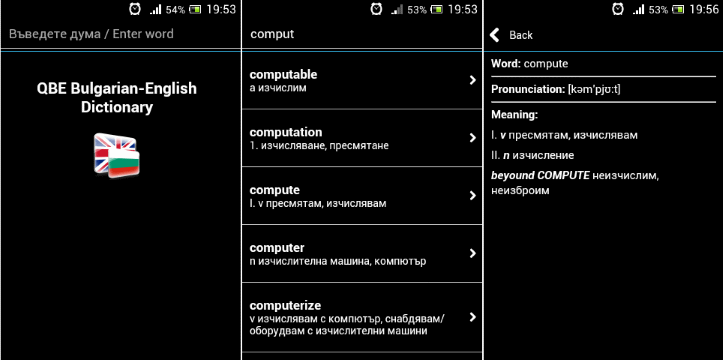

QBE Dictionary for Mobile Devices
=====================================================

About
-----
`QBE Dictionary` is a cross-platform Bulgarian-English dictionary built on Intel(R) XDK platform.



The project uses data in format, that is compatible with dictionaries of [bgoffice project](http://bgoffice.sourceforge.net), and has been tested to work with ["en-bg"](http://sourceforge.net/p/bgoffice/code/HEAD/tree/trunk/dictionaries/data/en-bg/) and ["bg-en"](http://sourceforge.net/p/bgoffice/code/HEAD/tree/trunk/dictionaries/data/bg-en/) dictionaries.

Dictionary data is not redistributed, as the authors of bgoffice project do not state clearly what is the license of this data. Instead, a Gulp script is provided that shows how to use such data.

How to build?
-------------

Note that, when using Intel(R) XDK, the actual build process is not done on your development PC, but in the cloud. The steps described below just prepare you for the build process.

Instructions are provided only for Windows 8.1. Procedure for building on other platforms is similar.

### Requirements

* Intel(R) XDK version 2366 or newer
* git
* node.js
* gulp
* Mobile device for testing application
	
### Build on Windows 8.1

1. Install Intel XDK:

   Download Intel XDK version (version 2366 or newer) from [Intel Developer Zone](https://software.intel.com/en-us/intel-xdk) and create a developer account.
  
2. Get source code from Github:
   
   ```batch
   d:
   cd \
   git clone https://github.com/quasoft/qbedict-mobile.git
   cd qbedict-mobile
   ```
   
3. Install node.js packages:

   ```batch
   node install
   ```
   The following node.js and gulp packages should be installed automatically:
   * node.js
       * request
       * run-sequence
       * string
       * vinyl-map
   * gulp
       * gulp-concat-json
       * gulp-convert-encoding
       * gulp-remote-src
       * gulp-rename
       * gulp-util

4. Prepare dictionary data:

   Use sample gulp script to prepare dictionary data (from bgoffice project).

   ```batch
   gulp update-data
   gulp convert-data
   ```
   
   Modify script if you want to use another data source.
   (Output format of data should be JSON - see files in data/en-bg folder for samples).   
   
5. Open project (file qbedict-mobile.xdk) in Intel(R) XDK.

6. Test in Emulator and on real device.

8. Build and upload to platform stores.

License
-------
Project is licensed under GNU GPLv2.0. See file LICENSE for more information.


